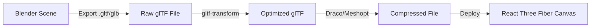

# Rezzil-Level Upgrade Checklist

> [!NOTE]
> This checklist explains why legacy procedural geometry feels basic, lists the exact production asset classes needed for true premium quality, and outlines the export and WebGL runtime optimization pipeline.

---

## 1. Why Your Current Blender Scene Looks Basic
If you open the scene and it looks like a flat-shaded schematic:
1. **Solid Viewport Mode:** You are likely viewing the viewport in **Solid Mode** (which shows uniform clay colors for fast geometry modeling). To see the actual material, light, and texture work, press **`Z`** and select **`Material Preview`** or **`Rendered`**.
2. **Procedural Proxying:** At this phase, players are built from simple procedural shapes (capsules and spheres) rather than custom character assets with organic contours, running gaits, and kit texturing. This is ideal for positional tracking validation but requires replacement for presentation-tier visuals.
3. **No Mocap / Authored Assets:** Rigged humanoid actors, kit materials, goal net dynamics, and detailed stadium facades are placeholder shapes generated mathematically by script, rather than PBR-textured static assets.

---

## 2. Production Asset Classes Required for Commercial Premium Visuals
To graduate from procedural proxying to a true commercial broadcast-tier product, you need to swap the procedural elements with four core asset classes:

| Asset Class | Type | Technical Requirements |
| :--- | :--- | :--- |
| **Humanoid Athletes** | Rigged GLB/glTF | Fully rigged skeleton (compatible with Mixamo/FBX, 10k–15k triangles), textured claret/sky blue (Villa) and deep navy/red (PSG) PBR kits, customized boot designs. |
| **Dynamic Animations** | glTF Actions | Authored gait states (idle, jog, full sprint, decelerations, pass swings, lateral slides) driven by coordinate delta triggers. |
| **Modular Stadium** | Modular GLB | Low-poly textured seating, concrete structures, custom tunnel models, 3D dugouts, realistic corner flags, and detailed goal nets. |
| **Tactical Shaders** | PBR / WebGL | Glowing HSL player rings, sharp dotted lines, shaded pass cones, and compact CSS overlay cards. |

---

## 3. The GLB/glTF Export & Optimization Pipeline
To export your high-end Blender authoring scene successfully into browser-ready interactive assets:



### Step 1: Export Settings in Blender
When exporting your final assets from Blender:
* Go to **`File -> Export -> glTF 2.0 (.glb/.gltf)`**.
* **Include:** Selected Objects, Custom Properties.
* **Transform:** `Y Up` (standard for glTF).
* **Geometry:** Apply Modifiers, Include UVs, Normals, and Vertex Colors.
* **Animation:** Include Rest Pose, Shape Keys, and active Animations.

### Step 2: Optimization via CLI
Run `gltf-transform` to compress meshes, merge identical materials, and pack textures:
```bash
# Clean up duplicate vertices, merge duplicate materials
npx @gltf-transform/cli inspect raw_model.glb
npx @gltf-transform/cli deduplicate raw_model.glb optimized.glb

# Compress geometry using Draco or Meshopt
npx @gltf-transform/cli draco optimized.glb final_compressed.glb
```

### Step 3: Texture Compression
Convert high-res PNG/JPG textures to ultra-efficient **KTX2/BasisU** textures:
```bash
# This significantly cuts GPU memory usage and prevents mobile browser crashes
npx @gltf-transform/cli etc1s optimized.glb compressed_textures.glb
```

---

## 4. React Three Fiber (R3F) Web Viewer Architecture
To build a high-performance interactive web application, follow this clean architecture:

### 1. Separate State Engine
Keep player coordinates and game logic outside of R3F rendering loops. Use **Zustand** or similar lightweight state stores to track:
* Playhead frame (`1` to `250`).
* Play/Pause/Replay states.
* Selected Camera ID (`broadcast`, `tactical`, `player`).

### 2. High-Performance Canvas Loop
Use R3F's `useFrame` hook to update the positional matrices of player mesh instances directly, bypassing React re-renders:
```jsx
import { useRef } from 'react'
import { useFrame } from '@react-three/fiber'

function Player({ playerId, trackingData }) {
  const ref = useRef()

  useFrame((state) => {
    const frame = state.gl.currentFrame // Get active frame from store
    const position = trackingData[playerId][frame]
    if (position) {
      ref.current.position.set(position.x, position.y, position.z)
    }
  })

  return <mesh ref={ref} geometry={...} material={...} />
}
```

### 3. Decoupled DOM-Based HUD
> [!IMPORTANT]
> Never render dense HUD cards, stats, scoreboards, or menus inside WebGL. This causes major performance degradation and rendering complications.

* Render all menus, collapsible stats sheets, scoreboards, and playback sliders in **standard HTML/CSS/React DOM elements** floating above the WebGL `<canvas>`.
* Use lightweight CSS-based 2D overlay tags pinned to 3D positions using R3F's `<Html>` helper from `@react-three/drei`.
