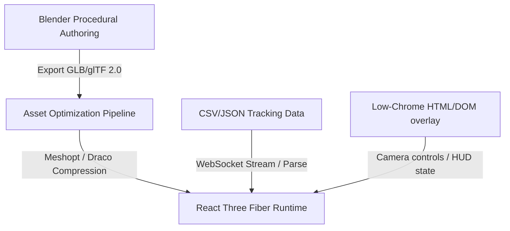

# Rezzil-Grade Football Scene Upgrade Design

## Goal
Upgrade the current placeholder football scene into a premium 3D authoring package that looks credible in Blender now and defines a clean, scalable route to a real-time Rezzil-class training product later.

---

## Current Scene Weaknesses
The initial prototype scene was structurally useful for coordinate validation but visually early-stage:
* **Primitive Player Geometry:** Players were represented as simple cylinders and spheres with no silhouette details, anatomical proportions, pose language, or running movement.
* **Blocky Stadium Dressing:** The stadium environment was flat, low-depth block geometry lacking seating texture, crowd density/variety, team benches, players' tunnels, roof truss details, or authentic floodlight gantries.
* **Flat Pitch Texturing:** The playing field was flat green geometry with basic uniform tiling. It lacked turf noise, realistic mower stripe variations, plausible chalk paint texture, or contact shadow depth.
* **Intrusive Overlays:** Tactical overlays were oversized and bright, dominating the camera view rather than acting as a supportive analysis layer.
* **Solid Mode Presentation:** The default view was set to Blender's Solid viewport mode, obscuring existing material properties, lights, and shadings.

---

## Target Experience
The upgraded scene should immediately present as a broadcast-quality tactical analysis package:
1. **Composition First:** Framings and camera paths should emulate professional sports broadcasting, letting the stadium scale, floodlight angles, turf color, and atmosphere carry the visual weight.
2. **Athletic Player Representation:** Players should clearly read as athletes at a glance, presenting correct skeletal proportions, direction indicators, and running cycles even when kept as procedural proxies.
3. **Restrained, Clean UI:** Overlays, halos, and trajectories should use thin, high-fidelity glowing lines that anchor underneath the player or along the ground without cluttering the playfield.
4. **Data-Driven Foundations:** Scene groups, collections, and coordinates should remain fully dynamic, allowing external CSV or JSON tracking logs to easily replace procedural paths.

---

## Immediate Upgraded Deliverable
The `generate_first10_villa_psg_premium.py` script will procedurally generate:
* **A Richer UEFA Pitch:** Layered dark/light mowing stripes, organic turf wear/color noise patches, standard UEFA markings, and a raised paint plane that reacts nicely to direct overhead light.
* **A Detailed Stadium Bowl:** Multi-tier seated concrete bowl with concrete steps, color-banded crowds, player benches, players' entrance tunnel, floodlight columns, and a fog volume for atmospheric glow.
* **Richer Procedural Athletes:** Proportional heads, athletic torsos, shirts, shorts, arms, legs, socks, and boots, facing orientation derived from motion vectors, and a basic running/jogging swing.
* **Polished Tactical Overlays:** Edge-anchored player possession halos, clean trajectory ribbons, and compact text badges isolated in a distinct `Overlays` collection.
* **Polished Camera & Render Setup:** Balanced area lights, three customized camera viewpoints (Broadcast Tracking, Overhead Tactical, Player-Level Review), Cycles renderer defaults (shutter motion blur, depth-of-field, filmic look), and organized collections.

---

## Downstream Runtime & Asset Pipeline
To transform the Blender authoring package into an interactive WebGL or VR product (e.g., a browser-based trainer):

### 1. The Asset Pipeline
* **GLB/glTF 2.0 Export:** Clean parenting and clear naming conventions (`AVL_Player_01`, `Match_Ball`, etc.) to ensure modular components are accessible via code.
* **Mesh & Texture Optimization:** Use `gltf-transform` to compress meshes (via Draco or Meshopt) and convert textures into optimized KTX2/BasisU formats.
* **Explicit Pivot Points:** Ensure athlete and ball origins are rooted at their exact ground contact points (`z = 0`) to prevent visual clipping.

### 2. React Three Fiber (R3F) Web Runtime
* **Decoupled State Engine:** Keep player positions, ball velocity, and playhead states in a fast, vanilla JavaScript/Zustand engine, updating threejs instances directly inside a `useFrame` loop.
* **High-Performance Materials:** Swap complex procedural shaders with lightweight PBR textures (roughness, metalness, normal maps) to achieve stable 60fps inside web browsers.

### 3. DOM-Based Low-Chrome HUD
* **Primary Status Bar (Top/Top-Left):** Clean score panel, time-code, active play phase.
* **Secondary Context Panels (Collapsible):** In-depth tactical stats, team shapes, speed readouts.
* **Canvas Decoupling:** Keep text tags, menus, and charts out of WebGL; render them in clean CSS/HTML overlays aligned perfectly to 3D object screenspace coordinates.

---

## Quality Metrics
* **Composition Check:** The environment looks believable and high-end even with all tactical overlays turned off.
* **Visual Consistency:** Player numbers and orientations are readable under both the broadcast zoom and tactical top-down cameras.
* **Performance Readiness:** High asset reuse, organized hierarchies, and unified texture slots.
