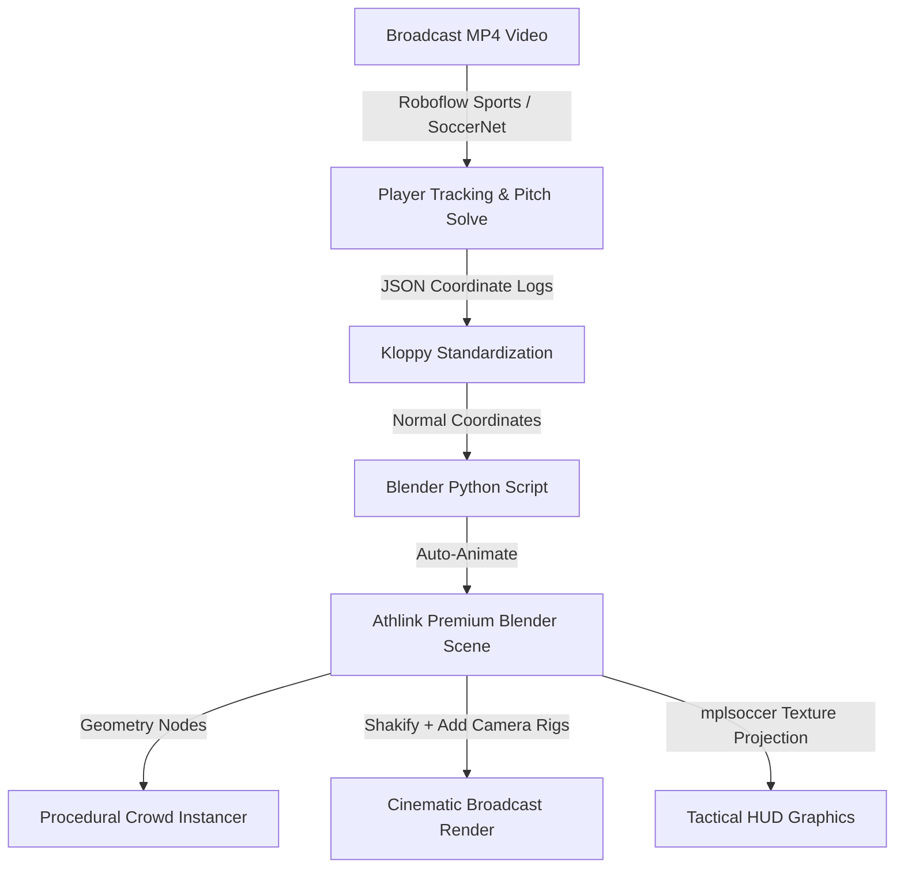

# Open-Source Sports Graphics & Tactical Analysis Tools for Blender

This report compiles and ranks the best open-source software, Python packages, Blender extensions, and computer vision pipelines to automate the transition from raw broadcast football footage or tracking logs into high-fidelity, premium 3D tactical reviews.

---

## 📊 Summary Comparison: The Top 10 Tools

| Rank | Tool / Repository | Primary Focus | Blender Integration | Automation Level | License |
| :--- | :--- | :--- | :--- | :--- | :--- |
| **1** | [Camera Shakify](#1-camera-shakify) | Cinematic Camera Movement | Native Add-on (100%) | Fully Automated | GPL-3.0 |
| **2** | [kloppy](#2-kloppy) | Tracking Data Standardization | Embedded Scripting (100%) | Fully Automated | Apache-2.0 |
| **3** | [Add Camera Rigs](#3-add-camera-rigs) | Dolly/Crane Camera Animation | Shipped Native (100%) | Semi-Automated | GPL-3.0 |
| **4** | [mplsoccer](#4-mplsoccer) | 2D Heatmaps & Pass Overlays | Texture Projection (100%) | Fully Automated | MIT |
| **5** | [Camera Preset Generator](#5-camera-preset-generator) | Pre-built Cinematic Motion | Native Add-on (100%) | Fully Automated | GPL-3.0 |
| **6** | [Roboflow Sports](#6-roboflow-sports) | CV Object Tracking & Pitch Solve | JSON Export to Blender | Fully Automated | Apache-2.0 |
| **7** | [AnimAide](#7-animaide) | F-Curve Easing & Key Correction | Native Add-on (100%) | Workflow Helper | GPL-3.0 |
| **8** | [InAIte](#8-inaite) | Lightweight Crowd Simulation | Native Add-on (100%) | Semi-Automated | MIT |
| **9** | [SoccerNet Game State](#9-soccernet-game-state) | Full Pitch Reconstruction | JSON Export to Blender | Fully Automated | Apache-2.0 |
| **10**| [Packt Geometry Nodes](#10-procedural-modeling-via-geometry-nodes) | Procedural Crowds & Stadiums | Native Nodes (100%) | Fully Automated | MIT |

---

## 🛠️ Detailed Repository Breakdowns

### 1. Camera Shakify
* **GitHub URL:** [EatTheFuture/camera_shakify](https://github.com/EatTheFuture/camera_shakify)
* **What it does:** Adds realistic, natural camera shake using actual motion-tracked data from real camera rigs (handheld, shoulder-mount, walking, pans).
* **Blender Version Compatibility:** 100% compatible with modern Blender (4.x/5.x). Available via the native Blender Extensions platform.
* **Installation Steps:**
  1. Open Blender and go to `Edit -> Preferences -> Get Extensions`.
  2. Search for `Camera Shakify` and click **`Install`**.
  3. Alternatively, download the `.zip` from GitHub and install manually.
* **How it helps your project:** Rezzil-class visuals rely heavily on the camera feeling "physically present." Shakify instantly removes the sterile "vector computer path" look from your `Camera_Broadcast` track, making it feel like a real cameraman is tracking the play from a gantry.
* **Pros & Cons:**
  * **Pros:** Instantly elevates render realism; very low performance overhead; highly customizable (influence, speed, focal length scaling).
  * **Cons:** Purely cosmetic; does not help generate tracking coordinates.
  * **Automation:** Fully automates cinematic camera jitter.

---

### 2. kloppy (Python Sports Analytics)
* **GitHub URL:** [PySport/kloppy](https://github.com/PySport/kloppy)
* **What it does:** Standardizes diverse football tracking data (e.g., StatsBomb, Metrica Sports, Tracab, ChyronHego, Wyscout) into a unified, clean Python dataset model. Handles coordinate transformations, dimensional normalization, and event querying.
* **Blender Version Compatibility:** Runs perfectly inside Blender's embedded Python runtime.
* **Installation Steps:**
  Within Blender's Python console (or via system terminal pointing to Blender's `bin/python`):
  ```bash
  pip install kloppy pandas
  ```
* **How it helps your project:** Ingesting dynamic positions is painful due to coordinate clashes. `kloppy` normalizes various tracking APIs so a single importer script can drive player locations, orientations, and passing lanes regardless of the source.
* **Pros & Cons:**
  * **Pros:** The gold standard for sports data formatting; handles complex event filtering (e.g., extracting only "successful passes under pressure") out of the box.
  * **Cons:** CLI/code-only, requires writing the loading bridge into `bpy`.
  * **Automation:** Fully automates raw sports coordinate parsing.

---

### 3. Add Camera Rigs
* **GitHub URL:** [waylow/add_camera_rigs](https://github.com/waylow/add_camera_rigs)
* **What it does:** Shills pre-built Dolly, Crane, and 2D camera rigs controlled via standard armature bones, enabling mechanical dolly tracks and vertical sweeps.
* **Blender Version Compatibility:** Shipped built-in with standard Blender installs.
* **Installation Steps:**
  1. Go to `Preferences -> Add-ons`.
  2. Enable **`Add Camera Rigs`**.
  3. In the 3D Viewport, press `Shift+A` -> `Camera` -> select `Dolly Camera Rig` or `Crane Camera Rig`.
* **How it helps your project:** Allows you to target an armature bone to your ball or specific players. When they move, the camera smoothly tracks them using physical constraints, replicating standard stadium TV gantry swings.
* **Pros & Cons:**
  * **Pros:** Extremely stable; standard bone drivers make targeting players foolproof.
  * **Cons:** Requires manual F-curve keyframing of the rig's main track slider.
  * **Automation:** Semi-automated (structural rig only).

---

### 4. mplsoccer
* **GitHub URL:** [andrewRowlinson/mplsoccer](https://github.com/andrewRowlinson/mplsoccer)
* **What it does:** A comprehensive plotting library to render soccer pitches, pizza charts, heatmaps, passing networks, and pass maps.
* **Blender Version Compatibility:** Fully compatible; executes in Blender’s Python space and writes out textures.
* **Installation Steps:**
  ```bash
  pip install mplsoccer matplotlib
  ```
* **How it helps your project:** Generate gorgeous dynamic passing network diagrams, player possession heatmaps, or pressing structures inside Python, save them as transparent PNGs, and project them as **Dynamic Decal Textures** onto your Blender pitch.
* **Pros & Cons:**
  * **Pros:** Creates professional sports-broadcaster infographics instantly.
  * **Cons:** Generates 2D Matplotlib files; requires manual texture projection mapping inside Blender's shader nodes.
  * **Automation:** Fully automates the calculation and drawing of tactical diagrams.

---

### 5. Blender Camera Preset Generator
* **GitHub URL:** [butaixianran/Blender-Camera-Preset-Generator](https://github.com/butaixianran/Blender-Camera-Preset-Generator)
* **What it does:** Generates camera motion sweeps using 98 pre-built professional cinematic camera movement presets, and features an integrated camera switcher.
* **Blender Version Compatibility:** Compatible with Blender 3.x, 4.x, and 5.x.
* **Installation Steps:**
  1. Download the `.zip` file from the repository.
  2. Open Blender Preferences, click `Install...`, and select the downloaded zip.
  3. Enable **`Camera Preset Generator`**.
* **How it helps your project:** Instantly generates professional, mathematically smooth sweeps (like zoom sweeps, focus-pulls, orbiting track shots, and helicopter sweeps) to capture close-up reviews of crucial build-up play.
* **Pros & Cons:**
  * **Pros:** Massive time saver; preset library is excellent.
  * **Cons:** Dense UI panels; might require manual rotation adjustments depending on your stadium scale.
  * **Automation:** Fully automates standard camera motion presets.

---

### 6. Roboflow Sports
* **GitHub URL:** [roboflow/sports](https://github.com/roboflow/sports)
* **What it does:** Reusable computer vision repository containing object detection pipelines for ball tracking, player detection, jersey team assignment, and radar pitch projection.
* **Blender Version Compatibility:** External Python package. Export outputs (JSON coordinates) directly into Blender.
* **Installation Steps:**
  1. Deploy in a dedicated local conda environment:
     ```bash
     pip install roboflow-sports
     ```
  2. Execute the inference pipeline on your raw `.mp4` clip to output a CSV/JSON of player tracking logs.
* **How it helps your project:** Automates tracking data generation! Instead of manually keyframing player coordinates, this CV model extracts actual bounding boxes and project coordinates directly from your video, ready to be scripted into Blender.
* **Pros & Cons:**
  * **Pros:** Much simpler to run than full deep academic networks; good accuracy on standard broadcast feeds.
  * **Cons:** Outputs flat coordinates; still requires a parsing script in Blender to assign coordinates to meshes.
  * **Automation:** Fully automates video-to-coordinate extraction.

---

### 7. AnimAide
* **GitHub URL:** [AresAnimi/AnimAide](https://github.com/AresAnimi/AnimAide)
* **What it does:** Add-on providing interactive sliders to slide keyframes, ease curves, offset keys, and perform quick F-curve operations in the Graph Editor.
* **Blender Version Compatibility:** 100% compatible with modern Blender 4.x/5.x.
* **Installation Steps:**
  1. Download the latest `.zip` release.
  2. Install via `Blender Preferences -> Add-ons`.
* **How it helps your project:** If you need to manually tweak player runs, passing paths, or camera focus sweeps, AnimAide provides direct sliders to smooth or offset the transitions, making manual curve refinement incredibly fast.
* **Pros & Cons:**
  * **Pros:** Highly interactive; speeds up F-curve editing.
  * **Cons:** Purely a graph editor assistant; does not generate automatic visuals.
  * **Automation:** Workflow optimizer only.

---

### 8. InAIte (Crowd Simulation)
* **GitHub URL:** [Peter-Noble/InAIte](https://github.com/Peter-Noble/InAIte)
* **What it does:** A lightweight crowd simulation framework for Blender utilizing navmeshes and basic state transitions for populating background scenes.
* **Blender Version Compatibility:** Works with Blender 3.6 through 4.x.
* **Installation Steps:**
  1. Download the zip from GitHub.
  2. Install and enable via Blender Preferences.
* **How it helps your project:** Great if you want to create interactive stadium scenes where crowds or background staff walk procedurally near the pitch, tunnel, and benches based on simple paths.
* **Pros & Cons:**
  * **Pros:** True agent-based movement.
  * **Cons:** Heavy overhead for large stadiums; overkill for standard spectator stands (which are better off with static instancing).
  * **Automation:** Semi-automated agent logic.

---

### 9. SoccerNet Game State Reconstruction
* **GitHub URL:** [SoccerNet/sn-gamestate](https://github.com/SoccerNet/sn-gamestate)
* **What it does:** Academic state-of-the-art end-to-end framework for soccer match tracking: player bounding boxes, camera calibration estimation, jersey number recognition, and minimap coordinate projections.
* **Blender Version Compatibility:** External research library. Exports standard track-JSON models.
* **Installation Steps:**
  Requires a robust PyTorch environment and a high-end Nvidia GPU:
  ```bash
  git clone https://github.com/SoccerNet/sn-gamestate.git
  pip install -r requirements.txt
  ```
* **How it helps your project:** The ultimate automation path. It takes a raw, moving TV broadcast clip, dynamically calculates the moving camera focal/zoom parameters, extracts the absolute 3D position of all players, and writes it out as a structured JSON. Importing this JSON into Blender builds a 1:1 digital twin of the match.
* **Pros & Cons:**
  * **Pros:** World-class accuracy; fully integrates pitch calibration and player tracking.
  * **Cons:** Extremely high installation difficulty; requires strong CUDA-enabled GPU and academic ML knowledge.
  * **Automation:** Fully automates full-match 3D reconstruction.

---

### 10. Procedural Modeling via Geometry Nodes
* **GitHub URL:** [PacktPublishing/Procedural-3D-Modeling-Using-Geometry-Nodes-in-Blender-Second-Edn](https://github.com/PacktPublishing/Procedural-3D-Modeling-Using-Geometry-Nodes-in-Blender-Second-Edn)
* **What it does:** Code repositories and node maps covering complex array, scattering, and instancing setups in Blender.
* **Blender Version Compatibility:** 100% native in Blender 4.x/5.x.
* **Installation Steps:**
  Open the repository files, inspect the node setups, and rebuild the instancing nodes in your Blender project.
* **How it helps your project:** Teaches and provides standard node trees for character scattering. Crucial for stadium building: distribute 50,000 low-poly spectating spectators onto your seat geometry, randomize their scale, shirt colors, and cheer offsets natively.
* **Pros & Cons:**
  * **Pros:** Unmatched rendering performance; completely customizable inside standard Blender.
  * **Cons:** Requires a basic understanding of Geometry Node logic to adapt to custom stadium seat shapes.
  * **Automation:** Fully automates stadium crowd population.

---

## 📈 Integration Workflow: Rezzil-Grade Automation Pipeline


